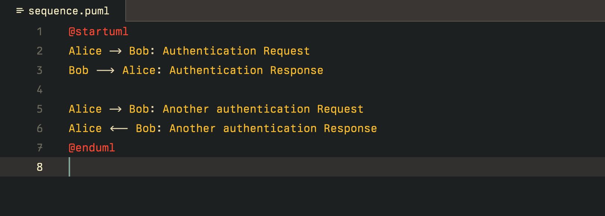

# PlantUML for Zed

An extension that adds PlantUML support for Zed.

Learn more about PlantUML at <https://plantuml.com/>

## Acknowledgments

- Tree-sitter grammar by Decodetalkers: [tree_sitter_plantuml](https://github.com/Decodetalkers/tree_sitter_plantuml)
